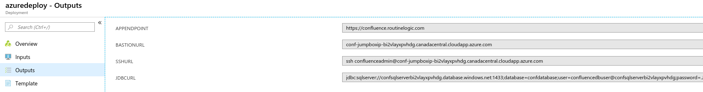

# Atlassian Bitbucket Data Center

Bitbucket Data Center gives you uninterrupted access to Bitbucket with performance at scale, disaster recovery and instant scalability when hosting our applications in your Azure private cloud account.

## Deploy to Azure Portal

## View Azure Deployment Results

View deployment output values in Azure Portal for endpoints, DB url etc.  

## Development
Please see the [DEVELOPING.md](../DEVELOPING.md) for more information on how you can use the update/develop the templates.
